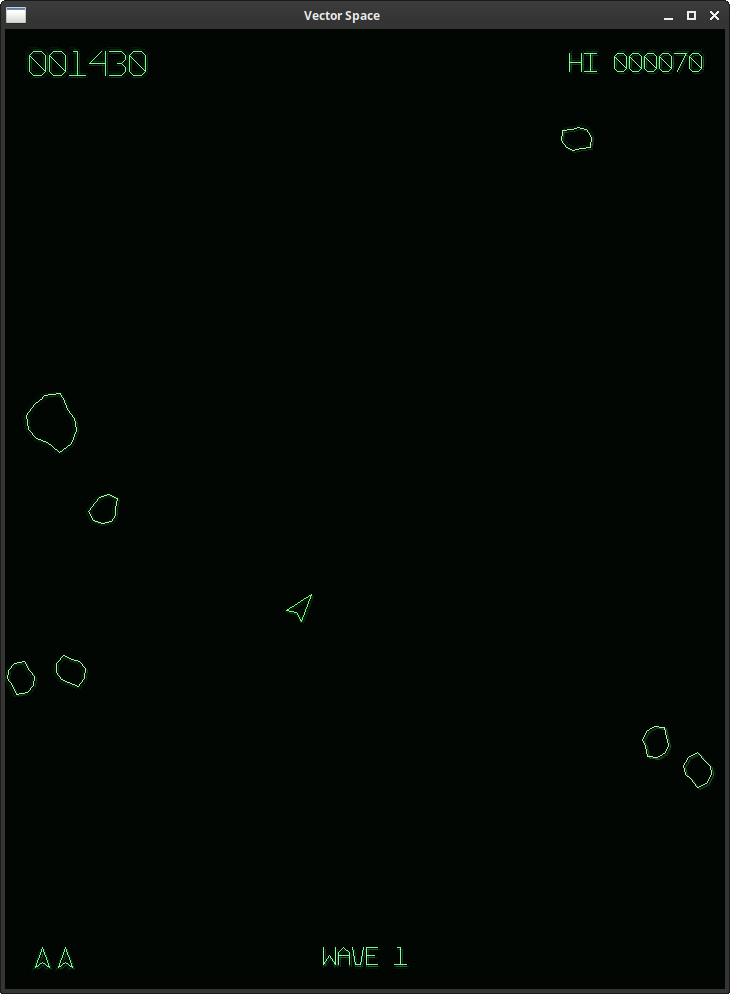

# Vector Space

Vector Space is a fast, portrait-oriented vector arcade game built with C++17
and SDL2. Pilot a small ship through increasingly dangerous fields of drifting
space rocks, destroy them before they collide with you, and survive attacks from
hostile pirate saucers.

The presentation is inspired by classic vector displays: every object and glyph
is drawn from line segments, with a bright core and a soft green phosphor glow.
The game uses a fixed 720 x 960 logical canvas and preserves its 3:4 aspect ratio
when the window is resized.



## Gameplay

- Large rocks split into medium rocks, then into small fragments.
- Waves contain 4, 6, 8, and eventually 10 large rocks.
- Pirate saucers periodically enter from either side and fire at the player.
- Large saucers are less accurate and award 200 points.
- Small saucers are more accurate and award 1,000 points.
- An extra ship is awarded every 10,000 points.
- The game includes wave introductions, temporary respawn protection, safe
  respawning, pausing, a high score, and a game-over screen.

## Controls

| Key | Action |
| --- | --- |
| Left / Right Arrow | Rotate the ship |
| Up Arrow | Thrust |
| Space or W | Fire |
| P | Pause or resume |
| Enter, Space, or R | Start a game from the title or game-over screen |
| Escape | Quit |

## Requirements

- A C++17-compatible compiler
- CMake 3.10 or newer
- SDL2 development files
- `pkg-config`

## Building on Linux

Install SDL2 and the standard build tools. On Debian or Ubuntu:

```sh
sudo apt install build-essential cmake pkg-config libsdl2-dev
cmake -S . -B build
cmake --build build --parallel
./build/vector_space
```

## Building on Windows with MSYS2

Open the **MSYS2 MinGW 64-bit** terminal and install the required packages:

```sh
pacman -S --needed mingw-w64-x86_64-gcc \
  mingw-w64-x86_64-cmake \
  mingw-w64-x86_64-SDL2 \
  mingw-w64-x86_64-pkgconf \
  mingw-w64-x86_64-ninja
```

Build the game from the project directory:

```sh
cmake -S . -B build -G Ninja
cmake --build build
./build/vector_space.exe
```

When distributing the Windows executable, place the matching `SDL2.dll` next
to `vector_space.exe`.

## Project structure

- `src/game.*` contains the game loop, state transitions, scoring, collisions,
  and compositing.
- `src/ship.*` implements player movement and drawing.
- `src/asteroid.*` implements procedural rocks and fragmentation.
- `src/pirate.*` implements hostile saucers and their movement.
- `src/vector_font.*` contains the custom line-based font.
- `src/bullet.*` and `src/particle.*` implement projectiles and visual effects.

## Third-party software

Vector Space uses SDL2, which is distributed under the zlib license. No
original arcade ROMs, graphics, fonts, or sound assets are included.
